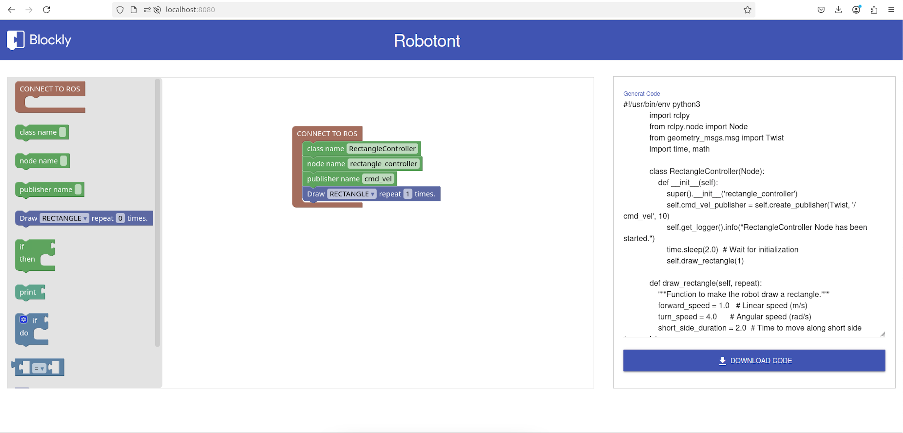
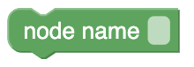

Robotont Blockly Web Application
=========

This code contains a Blockly based web application to control Robotont. This repo can be used to set up a local web application running Blockly as the visual programming language and translate the blocks into Python ROS executable nodes.



### How to use?

This app is generated using `node` and `npm`

If you have not installed `Node.js` on your machine. Please visit [Node.js website](https://nodejs.org/en). 

```
$ git clone
$ npm install
$ node server.js
```

Visit `http://localhost:8080/` to change the port number view `server.js`

## Available Block examples

This setup contains some of the Vanilla Blockly blocks along with some custom blocks to achieve ROS compatibility. Below defined custom blocks are available.

### ROS node scaffold


This Blockly block has the following JavaScript definition

```javascript
Blockly.Blocks["ros_connection"] = {
  init: function () {
    this.appendDummyInput("DUMMY")
      .setAlign(Blockly.inputs.Align.RIGHT)
      .appendField("CONNECT TO ROS");
    this.appendStatementInput("ros_connection");
    this.setTooltip("set ros node parameters");
    this.setHelpUrl("none");
    this.setColour(15);
  },
};
```

A subsequent python code generation code for this block

```javascript
python.pythonGenerator.forBlock["ros_connection"] = function (block) {
  let code = ``;
  return code;
};
```
### Basic robot movements

  

This Blockly block has the following JavaScript definition

```javascript
Blockly.Blocks["robotont_move"] = {
  init: function () {
    this.appendDummyInput()
      .appendField("Draw")
      .appendField(
        new Blockly.FieldDropdown([
          ["RECTANGLE", "RECTANGLE"],
          ["CIRCLE", "CIRCLE"],
          ["STRAIGHT LINE", "STRAIGHT_LINE"],
        ]),
        "DIRECTION"
      )
      .appendField("repeat")
      .appendField(new Blockly.FieldNumber(0, 0, 3, 1), "SPEED")
      .appendField("times.");
    this.setPreviousStatement(true);
    this.setNextStatement(true);
    // this.setOutput(true, null);
    this.setColour(230);
    this.setTooltip("Move robot forward/backward");
  },
};
```

A subsequent python code generation code for this block

```javascript
python.pythonGenerator.forBlock["robotont_move"] = function (block) {
  const code = ``;
  return code;
};
```

These blocks definitions given below have an advanced use, if we want to change the scaffoled class name, node name, or publisher name.

### Edit class name


This Blockly block has the following JavaScript definition

```javascript
Blockly.Blocks["class_name"] = {
  init: function () {
    this.appendDummyInput("class name")
      .setAlign(Blockly.inputs.Align.RIGHT)
      .appendField("class name")
      .appendField(new Blockly.FieldTextInput(""), "className");
    this.setNextStatement(true, null); // Can connect to blocks after it
    this.setPreviousStatement(true, null); // Can connect to blocks before it
    this.setTooltip("set class name");
    this.setHelpUrl("none");
    this.setColour(120);
  },
};
```

A subsequent python code generation code for this block

```javascript
python.pythonGenerator.forBlock["class_name"] = function (block) {
  const code = ``;
  return code;
};
```
### Edit node name



This Blockly block has the following JavaScript definition

```javascript
Blockly.Blocks["node_name"] = {
  init: function () {
    this.appendDummyInput("node name")
      .setAlign(Blockly.inputs.Align.RIGHT)
      .appendField("node name")
      .appendField(new Blockly.FieldTextInput(""), "nodeName");
    this.setNextStatement(true, null); // Can connect to blocks after it
    this.setPreviousStatement(true, null); // Can connect to blocks before it

    this.setTooltip("set node name");
    this.setHelpUrl("none");
    this.setColour(120);
  },
};
```

A subsequent python code generation code for this block

```javascript
python.pythonGenerator.forBlock["node_name"] = function (block) {
  const code = ``;
  return code;
};
```

### Edit publisher name


This Blockly block has the following JavaScript definition

```javascript
Blockly.Blocks["publisher_name"] = {
  init: function () {
    this.appendDummyInput("publisher name")
      .setAlign(Blockly.inputs.Align.RIGHT)
      .appendField("publisher name")
      .appendField(new Blockly.FieldTextInput(""), "publisherName");
    this.setNextStatement(true, null); // Can connect to blocks after it
    this.setPreviousStatement(true, null); // Can connect to blocks before it
    this.setTooltip("set publisher name");
    this.setHelpUrl("none");
    this.setColour(120);
  },
};
```

A subsequent python code generation code for this block

```javascript
python.pythonGenerator.forBlock["publisher_name"] = function (block) {
  const code = ``;
  return code;
};
```

## Blockly integration

Custom blocks are inserted in the Blockly workspace using XML. 

```javascript
const workspace = Blockly.inject("blocklyDiv", {
  toolbox: `
      <xml>
          <block type="ros_connection"></block>
          <block type="class_name"></block>
          <block type="node_name"></block>
          <block type="publisher_name"></block>
          <block type="robotont_move"></block>
          <block type="robotont_if"></block>
          <block type="robotont_print"></block>
          <block type="controls_if"></block>
          <block type="logic_compare"></block>
          <block type="math_number"></block>
          <block type="text_print"></block>
      </xml>
  `,
  media: "https://unpkg.com/blockly/media/",
});
```

workspace changes are handle by this function synchronize generated code

```javascript
workspace.addChangeListener(() => {
   const code = Blockly.Python.workspaceToCode(workspace);
   document.getElementById("generatedCode").value = code;
});
```
