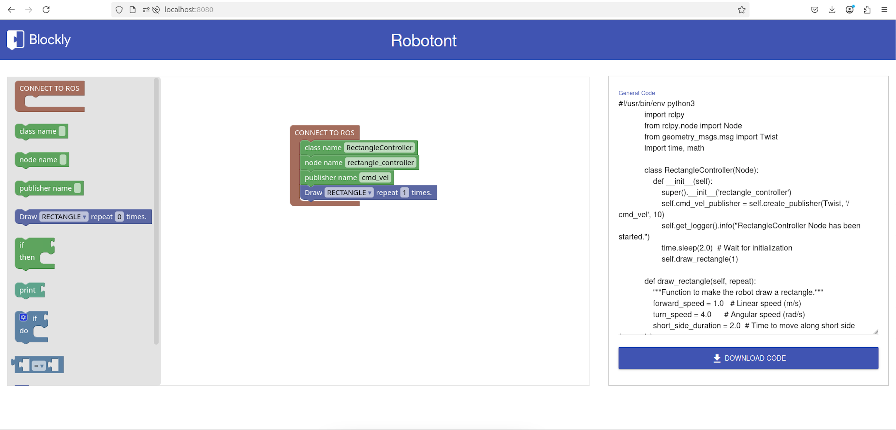
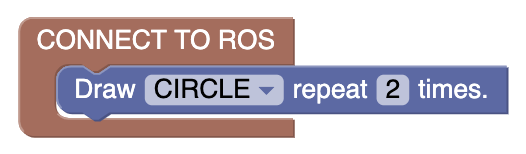
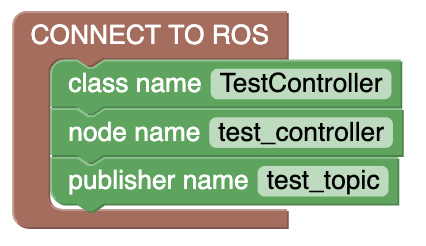

# Robotont Blockly Web Application

This code contains a Blockly based web application to control Robotont. This repo can be used to set up a local web application running Blockly as the visual programming language and translate the blocks into Python ROS executable nodes.



### How to use?

This app is generated using `node` and `npm`

If you have not installed `Node.js` on your machine. Please visit [Node.js website](https://nodejs.org/en).

```
$ git clone
$ npm install
$ node server.js
```

Visit `http://localhost:8080/` to change the port number view `server.js`

## Available Block examples

This setup contains some of the Vanilla Blockly blocks along with some custom blocks to achieve ROS compatibility. Below defined custom blocks are available.

### ROS node scaffold


This Blockly block has the following JavaScript definition

```javascript
Blockly.Blocks["ros_connection"] = {
  init: function () {
    this.appendDummyInput("DUMMY")
      .setAlign(Blockly.inputs.Align.RIGHT)
      .appendField("CONNECT TO ROS");
    this.appendStatementInput("ros_connection");
    this.setTooltip("set ros node parameters");
    this.setHelpUrl("none");
    this.setColour(15);
  },
};
```

A subsequent python code generation for this block

```javascript
python.pythonGenerator.forBlock["ros_connection"] = function (block) {
  // Get all the statements inside the ros_connection block
  const statements = Blockly.Python.statementToCode(block, "ros_connection");

  // Find all the configuration blocks within this ros_connection block
  let className = "RobotController";
  let nodeName = "robot_controller";
  let publisherName = "/cmd_vel";
  let movementType = "";
  let repeatCount = 0;

  // Get the top block in the statement input
  let currentBlock = block.getInputTargetBlock("ros_connection");

  while (currentBlock) {
    switch (currentBlock.type) {
      case "class_name":
        className = currentBlock.getFieldValue("className") || className;
        break;
      case "node_name":
        nodeName = currentBlock.getFieldValue("nodeName") || nodeName;
        break;
      case "publisher_name":
        publisherName =
          currentBlock.getFieldValue("publisherName") || publisherName;
        break;
      case "robotont_move":
        movementType = currentBlock.getFieldValue("DIRECTION");
        repeatCount = currentBlock.getFieldValue("SPEED");
        break;
    }
    currentBlock = currentBlock.getNextBlock();
  }

  // Generate movement function based on selected type
  let movementFunction = "";
  switch (movementType) {
    case "RECTANGLE":
      movementFunction = `
            def draw_rectangle(self, repeat):
                """Function to make the robot draw a rectangle."""
                forward_speed = 1.0   # Linear speed (m/s)
                turn_speed = 4.0      # Angular speed (rad/s)
                short_side_duration = 2.0  # Time to move along short side (seconds)
                long_side_duration = 4.0   # Time to move along long side (seconds)
                turn_duration = 1.629 / turn_speed  # Time to turn 90 degrees (1.57 radians)

                # Create Twist message for forward motion
                move_forward = Twist()
                move_forward.linear.x = forward_speed
                move_forward.angular.z = 0.0

                # Create Twist message for turning
                turn = Twist()
                turn.linear.x = 0.0
                turn.angular.z = turn_speed

                for _ in range(repeat*2):
                    # Move forward along the long side
                    self.get_logger().info("Moving along the long side...")
                    self.cmd_vel_publisher.publish(move_forward)
                    time.sleep(long_side_duration)

                    # Turn 90 degrees
                    self.get_logger().info("Turning 90 degrees...")
                    self.cmd_vel_publisher.publish(turn)
                    time.sleep(turn_duration)

                    # Move forward along the short side
                    self.get_logger().info("Moving along the short side...")
                    self.cmd_vel_publisher.publish(move_forward)
                    time.sleep(short_side_duration)

                    # Turn 90 degrees
                    self.get_logger().info("Turning 90 degrees...")
                    self.cmd_vel_publisher.publish(turn)
                    time.sleep(turn_duration)

                # Stop the robot after drawing
                self.get_logger().info("Stopping the robot...")
                stop = Twist()
                self.cmd_vel_publisher.publish(stop)
        `;
      break;

    case "CIRCLE":
      movementFunction = `
            def draw_circle(self, repeat):
                """Function to make the robot draw a circle."""
                linear_speed = 1.0
                angular_speed = 0.5
                duration = 2.0  # Time for each circle segment
                
                for _ in range(repeat):
                    twist = Twist()
                    twist.linear.x = linear_speed
                    twist.angular.z = angular_speed
                    self.cmd_vel_publisher.publish(twist)
                    time.sleep(duration)
                
                # Stop the robot
                stop = Twist()
                self.cmd_vel_publisher.publish(stop)
        `;
      break;

    case "STRAIGHT_LINE":
      movementFunction = `
            def move_straight(self, repeat):
                """Function to make the robot move straight."""
                speed = 1.0
                duration = 2.0
                
                for _ in range(repeat):
                    twist = Twist()
                    twist.linear.x = speed
                    self.cmd_vel_publisher.publish(twist)
                    time.sleep(duration)
                
                # Stop the robot
                stop = Twist()
                self.cmd_vel_publisher.publish(stop)
        `;
      break;

    default:
      movementFunction = `
            # No movement function defined
            def no_movement(self):
                self.get_logger().info("No movement pattern selected")
        `;
  }

  // Generate the call to the movement function
  let movementCall = "";
  if (movementType === "RECTANGLE") {
    movementCall = `self.draw_rectangle(${repeatCount})`;
  } else if (movementType === "CIRCLE") {
    movementCall = `self.draw_circle(${repeatCount})`;
  } else if (movementType === "STRAIGHT_LINE") {
    movementCall = `self.move_straight(${repeatCount})`;
  }

  // Generate the complete Python code
  const code = `#!/usr/bin/env python3
            import rclpy
            from rclpy.node import Node
            from geometry_msgs.msg import Twist
            import time, math

            class ${className}(Node):
                def __init__(self):
                    super().__init__('${nodeName}')
                    self.cmd_vel_publisher = self.create_publisher(Twist, /${publisherName}, 10)
                    self.get_logger().info("${className} Node has been started.")
                    time.sleep(2.0)  # Wait for initialization
                    ${movementCall}
                    ${movementFunction}
            def main(args=None):
                rclpy.init(args=args)
                node = ${className}()
                rclpy.spin(node)
                rclpy.shutdown()

            if __name__ == "__main__":
                main()`;

  return code;
};
```

Code returned by the pythonGenerator

```python
#!/usr/bin/env python3
import rclpy
from rclpy.node import Node
from geometry_msgs.msg import Twist
import time, math

class RobotController(Node):
    def __init__(self):
        super().__init__('robot_controller')
        self.cmd_vel_publisher = self.create_publisher(Twist, //cmd_vel, 10)
        self.get_logger().info("RobotController Node has been started.")
        time.sleep(2.0)  # Wait for initialization


# No movement function defined
def no_movement(self):
    self.get_logger().info("No movement pattern selected")

def main(args=None):
    rclpy.init(args=args)
    node = RobotController()
    rclpy.spin(node)
    rclpy.shutdown()

if __name__ == "__main__":
    main()
```

### Basic robot movements


This Blockly block has the following JavaScript definition

```javascript
Blockly.Blocks["robotont_move"] = {
  init: function () {
    this.appendDummyInput()
      .appendField("Draw")
      .appendField(
        new Blockly.FieldDropdown([
          ["RECTANGLE", "RECTANGLE"],
          ["CIRCLE", "CIRCLE"],
          ["STRAIGHT LINE", "STRAIGHT_LINE"],
        ]),
        "DIRECTION"
      )
      .appendField("repeat")
      .appendField(new Blockly.FieldNumber(0, 0, 3, 1), "SPEED")
      .appendField("times.");
    this.setPreviousStatement(true);
    this.setNextStatement(true);
    // this.setOutput(true, null);
    this.setColour(230);
    this.setTooltip("Move robot forward/backward");
  },
};
```

A subsequent python code generation code for this block, to publish Twist messages.

```javascript
python.pythonGenerator.forBlock["robotont_move"] = function (block) {
  movementType = block.getFieldValue("DIRECTION");
  repeatCount = block.getFieldValue("SPEED");
  console.log("ROBOTONT MOVE BLOCK CHANGED...", movementType, repeatCount);

  let code = "";
  switch (movementType) {
    case "RECTANGLE":
      code = `
            def draw_rectangle(self):
                """Function to make the robot draw a rectangle."""
                forward_speed = 1.0   # Linear speed (m/s)
                turn_speed = 4.0      # Angular speed (rad/s)
                short_side_duration = 2.0  # Time to move along short side (seconds)
                long_side_duration = 4.0   # Time to move along long side (seconds)
                turn_duration = 1.629 / turn_speed  # Time to turn 90 degrees (1.57 radians)

                # Create Twist message for forward motion
                move_forward = Twist()
                move_forward.linear.x = forward_speed
                move_forward.angular.z = 0.0

                # Create Twist message for turning
                turn = Twist()
                turn.linear.x = 0.0
                turn.angular.z = turn_speed

                for _ in range(${repeatCount}*2):
                    # Move forward along the long side
                    self.get_logger().info("Moving along the long side...")
                    self.cmd_vel_publisher.publish(move_forward)
                    time.sleep(long_side_duration)

                    # Turn 90 degrees
                    self.get_logger().info("Turning 90 degrees...")
                    self.cmd_vel_publisher.publish(turn)
                    time.sleep(turn_duration)

                    # Move forward along the short side
                    self.get_logger().info("Moving along the short side...")
                    self.cmd_vel_publisher.publish(move_forward)
                    time.sleep(short_side_duration)

                    # Turn 90 degrees
                    self.get_logger().info("Turning 90 degrees...")
                    self.cmd_vel_publisher.publish(turn)
                    time.sleep(turn_duration)

                # Stop the robot after drawing
                self.get_logger().info("Stopping the robot...")
                stop = Twist()
                self.cmd_vel_publisher.publish(stop)
        `;
      break;

    case "CIRCLE":
      code = `
            def draw_circle(self):
                """Function to make the robot draw a circle."""
                linear_speed = 1.0
                angular_speed = 0.5
                duration = 2.0  # Time for each circle segment
                
                for _ in range(${repeatCount}):
                    twist = Twist()
                    twist.linear.x = linear_speed
                    twist.angular.z = angular_speed
                    self.cmd_vel_publisher.publish(twist)
                    time.sleep(duration)
                
                # Stop the robot
                stop = Twist()
                self.cmd_vel_publisher.publish(stop)
        `;
      break;

    case "STRAIGHT_LINE":
      code = `
            def move_straight(self):
                """Function to make the robot move straight."""
                speed = 1.0
                duration = 2.0
                
                for _ in range(${repeatCount}):
                    twist = Twist()
                    twist.linear.x = speed
                    self.cmd_vel_publisher.publish(twist)
                    time.sleep(duration)
                
                # Stop the robot
                stop = Twist()
                self.cmd_vel_publisher.publish(stop)
        `;
      break;

    default:
      code = `
            # No movement function defined
            def no_movement(self):
                self.get_logger().info("No movement pattern selected")
        `;
  }
  return code;
};
```

code returned by the pythonGenerator

```python
def draw_rectangle(self):
    """Function to make the robot draw a rectangle."""
    forward_speed = 1.0   # Linear speed (m/s)
    turn_speed = 4.0      # Angular speed (rad/s)
    short_side_duration = 2.0  # Time to move along short side (seconds)
    long_side_duration = 4.0   # Time to move along long side (seconds)
    turn_duration = 1.629 / turn_speed  # Time to turn 90 degrees (1.57 radians)

    # Create Twist message for forward motion
    move_forward = Twist()
    move_forward.linear.x = forward_speed
    move_forward.angular.z = 0.0

    # Create Twist message for turning
    turn = Twist()
    turn.linear.x = 0.0
    turn.angular.z = turn_speed

    for _ in range(0):
        # Move forward along the long side
        self.get_logger().info("Moving along the long side...")
        self.cmd_vel_publisher.publish(move_forward)
        time.sleep(long_side_duration)

        # Turn 90 degrees
        self.get_logger().info("Turning 90 degrees...")
        self.cmd_vel_publisher.publish(turn)
        time.sleep(turn_duration)

        # Move forward along the short side
        self.get_logger().info("Moving along the short side...")
        self.cmd_vel_publisher.publish(move_forward)
        time.sleep(short_side_duration)

        # Turn 90 degrees
        self.get_logger().info("Turning 90 degrees...")
        self.cmd_vel_publisher.publish(turn)
        time.sleep(turn_duration)

    # Stop the robot after drawing
    self.get_logger().info("Stopping the robot...")
    stop = Twist()
    self.cmd_vel_publisher.publish(stop)

```

These blocks definitions given below have an advanced use, if we want to change the scaffoled class name, node name, or publisher name.

### Edit class name


This Blockly block has the following JavaScript definition

```javascript
Blockly.Blocks["class_name"] = {
  init: function () {
    this.appendDummyInput("class name")
      .setAlign(Blockly.inputs.Align.RIGHT)
      .appendField("class name")
      .appendField(new Blockly.FieldTextInput(""), "className");
    this.setNextStatement(true, null); // Can connect to blocks after it
    this.setPreviousStatement(true, null); // Can connect to blocks before it
    this.setTooltip("set class name");
    this.setHelpUrl("none");
    this.setColour(120);
  },
};
```

A subsequent python code generation code for this block

```javascript
python.pythonGenerator.forBlock["class_name"] = function (block) {
  const code = ``;
  return code;
};
```

### Edit node name


This Blockly block has the following JavaScript definition

```javascript
Blockly.Blocks["node_name"] = {
  init: function () {
    this.appendDummyInput("node name")
      .setAlign(Blockly.inputs.Align.RIGHT)
      .appendField("node name")
      .appendField(new Blockly.FieldTextInput(""), "nodeName");
    this.setNextStatement(true, null); // Can connect to blocks after it
    this.setPreviousStatement(true, null); // Can connect to blocks before it

    this.setTooltip("set node name");
    this.setHelpUrl("none");
    this.setColour(120);
  },
};
```

A subsequent python code generation code for this block

```javascript
python.pythonGenerator.forBlock["node_name"] = function (block) {
  const code = ``;
  return code;
};
```

### Edit publisher name


This Blockly block has the following JavaScript definition

```javascript
Blockly.Blocks["publisher_name"] = {
  init: function () {
    this.appendDummyInput("publisher name")
      .setAlign(Blockly.inputs.Align.RIGHT)
      .appendField("publisher name")
      .appendField(new Blockly.FieldTextInput(""), "publisherName");
    this.setNextStatement(true, null); // Can connect to blocks after it
    this.setPreviousStatement(true, null); // Can connect to blocks before it
    this.setTooltip("set publisher name");
    this.setHelpUrl("none");
    this.setColour(120);
  },
};
```

A subsequent python code generation code for this block

```javascript
python.pythonGenerator.forBlock["publisher_name"] = function (block) {
  const code = ``;
  return code;
};
```

> If a block logic does not involve any code logic, (it might be used as a variable whose value can be used inside other block for data or code manupulations) the pythonGenerator should be configured for such a block to avoid errors.

To view in more depath on how to create custom Blockly blocks, visit [Google Blockly](https://developers.google.com/blockly/guides/create-custom-blocks/overview)

## Blockly integration

Custom blocks are inserted in the Blockly workspace using XML.

```javascript
const workspace = Blockly.inject("blocklyDiv", {
  toolbox: `
      <xml>
          <block type="ros_connection"></block>
          <block type="class_name"></block>
          <block type="node_name"></block>
          <block type="publisher_name"></block>
          <block type="robotont_move"></block>
          <block type="robotont_if"></block>
          <block type="robotont_print"></block>
          <block type="controls_if"></block>
          <block type="logic_compare"></block>
          <block type="math_number"></block>
          <block type="text_print"></block>
      </xml>
  `,
  media: "https://unpkg.com/blockly/media/",
});
```

An example html with blockly integration

```html
<!DOCTYPE html>
<html>
  <head>
    <title>Robotont Blockly App</title>
    <link rel="icon" href="data:," />
    <!-- Load Blockly from local scripts -->
    <script src="scripts/blockly.min.js"></script>
    <!-- Add after Blockly core for pythonGenerator -->
    <script src="scripts/python_compressed.js"></script>

    <!-- Link to local styles css -->
    <link rel="stylesheet" href="styles/index.css" />
  </head>
  <body>
    <!-- App header container -->
    <header class="header mdl-color--cyan-500">
      
      <h1 class="title">Robotont</h1>
    </header>

    <!-- Blockly Workspace Container -->
    <div id="blocklyDiv" style="height: 640px"></div>
  </body>
</html>
```

Workspace changes are handle by this function synchronize generated code

```javascript
workspace.addChangeListener(() => {
  const code = Blockly.Python.workspaceToCode(workspace);
  document.getElementById("generatedCode").value = code;
});
```

## Blocks usage example

Example block combinations for drawing a circle



Downloadable Python generated code from such block combination, to view the result simulation by executing this code [View animated gif](https://github.com/usman125/robotont-blockly-client/blob/main/RViZ_result_simulations/robotont_circle_simulation.gif).

```python
#!/usr/bin/env python3
import rclpy
from rclpy.node import Node
from geometry_msgs.msg import Twist
import time, math

class RobotController(Node):
    def __init__(self):
        super().__init__('robot_controller')
        self.cmd_vel_publisher = self.create_publisher(Twist, '/cmd_vel', 10)
        self.get_logger().info("RobotController Node has been started.")
        time.sleep(2.0)  # Wait for initialization
        self.draw_circle(2)

    def draw_circle(self, repeat):
        """Function to make the robot draw a circle."""
        linear_speed = 1.0
        angular_speed = 0.5
        duration = 2.0  # Time for each circle segment

        for _ in range(repeat):
            twist = Twist()
            twist.linear.x = linear_speed
            twist.angular.z = angular_speed
            self.cmd_vel_publisher.publish(twist)
            time.sleep(duration)

        # Stop the robot
        stop = Twist()
        self.cmd_vel_publisher.publish(stop)

    def main(args=None):
        rclpy.init(args=args)
        node = RobotController()
        rclpy.spin(node)
        rclpy.shutdown()

if __name__ == "__main__":
    main()
```

Overwrite defaut ROS node code



Downloadable Python generated code from such block combination

```python
#!/usr/bin/env python3
import rclpy
from rclpy.node import Node
from geometry_msgs.msg import Twist
import time, math

class TestController(Node):
    def __init__(self):
        super().__init__('test_controller')
        self.cmd_vel_publisher = self.create_publisher(Twist, '/test_topic', 10)
        self.get_logger().info("TestController Node has been started.")
        time.sleep(2.0)  # Wait for initialization


    # No movement function defined
    def no_movement(self):
        self.get_logger().info("No movement pattern selected")

    def main(args=None):
        rclpy.init(args=args)
        node = TestController()
        rclpy.spin(node)
        rclpy.shutdown()

if __name__ == "__main__":
    main()
```
